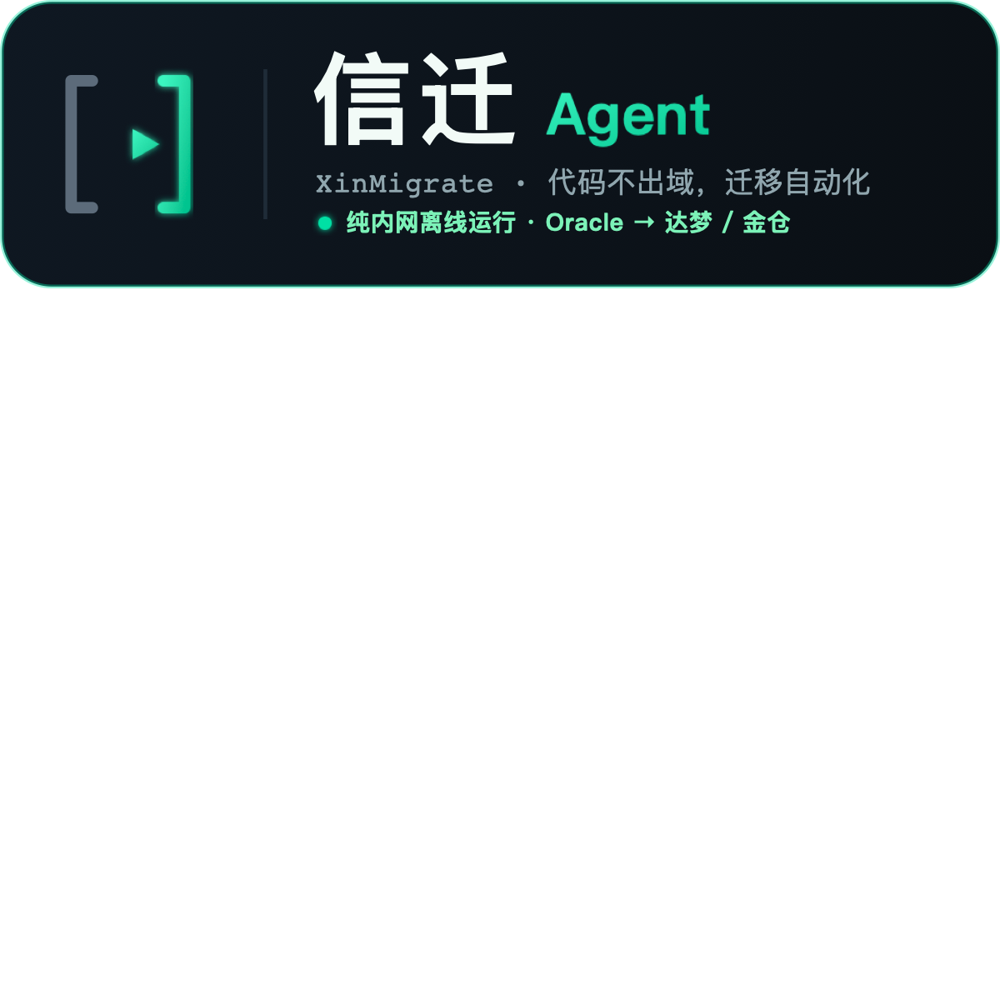

<p align="center">
  
</p>

<h1 align="center">信迁 Agent（XinMigrate）</h1>

<p align="center"><b>纯内网运行的国产化迁移 Agent —— 代码不出域，迁移自动化。</b></p>

---

## 项目说明

**一句话**：信迁 Agent 是一个**纯内网离线运行**的国产化数据库迁移 Agent——面向央国企信创替代场景，把 Oracle 老代码自动迁移到达梦 / 人大金仓等国产数据库，全程代码不出域。

- **应用场景**：信创国产化是国家级强制工程，央国企要把 Oracle 迁到国产库，但代码是敏感资产、法律禁止上云——所有云端 AI 工具（Copilot、通义灵码云版等）从根本上进不来。信迁 Agent 是唯一可行形态：**纯内网 / 端侧运行**。
- **技术架构**：端侧开源模型 **Qwen2.5-Coder**（经 **Ollama** 本地推理，OpenAI 兼容）+ 自研**轻量 ReAct 编排循环** + 工具层（方言扫描 / 迁移知识库 / 验证引擎 / 人工确认）。核心是 **「验证 → 自修复」闭环 + 语法 / 数据级语义双重校验**——端侧弱模型会犯错，靠强编排让它改错后自己改对，这是护城河而非套壳。前端 Streamlit，全程离线可跑。

> 把老代码喂给它，它自主 **扫描 → 规划 → 改写 → 验证 → 自修复 → 人工确认 → 产出报告**，全程跑在企业内网 / 端侧模型上，断网可用。

**团队**：昆伦战队 · 白卓昆 · 李昊伦

---

## 一、3 分钟跑起来（新机器照这个来）

```bash
# 1. 拉代码
git clone <仓库地址> && cd xin-migrate

# 2. Python 环境
python3 -m venv .venv && source .venv/bin/activate
pip install -r requirements.txt

# 3. 端侧模型（Ollama）—— 二选一
#   方案A：本机下载（独立，断网可用，推荐演示机用）
ollama pull qwen2.5-coder:7b      # 机器弱用 7b，强机用 32b
#   方案B：连局域网里队友已起好的模型服务（省资源）
#     在 .env 里把 OLLAMA_HOST 改成队友机器的局域网地址

# 4. 配环境变量
cp .env.example .env              # 按需改 .env

# 5. 跑一把 Demo
# 5. 跑一把 Demo（任务措辞越明确，端侧 7b 越听话）
python -m agent.loop --task "用 read_file 工具读取 data/demo_project/legacy_oracle.sql 的内容，再用 grep_dialect 扫描 Oracle 不兼容语法，逐项查规则迁移到达梦并用 run_validation 验证，验证失败时按报错修复指令重写完整SQL，全部通过后输出迁移报告"
# 注：界面演示请用 streamlit run web/app.py，现场建议「离线回放」模式最稳
```

---

## 二、目录结构 & 分工

| 目录 | 负责人 | 内容 |
|---|---|---|
| `agent/` | **A** | ReAct 编排循环、LLM 客户端、Prompt |
| `tools/` | **A** | Agent 的工具（读文件 / 查方言 / 验证 / 自修复） |
| `kb/`   | **B** | 迁移规则知识库（Oracle→达梦 语法对照表） |
| `data/` | **B** | 演示用的老代码项目（埋好不兼容点） |
| `web/`  | **B** | 演示界面（可视化 Agent 思考链） |

> 🔑 **协作铁律**：A 只碰 `agent/`+`tools/`，B 只碰 `kb/`+`data/`+`web/`，几乎不冲突。
> 高频 `git pull` / `git push`，每完成一小块就提交，最长别超过 1 小时不同步。

---

## 三、核心闭环

```
扫描 → 规划 → 改写 → 验证 → 自修复(失败重试) → 人工确认(高风险) → 产出代码+报告
```

**差异化命根子在「验证 + 自修复」**：端侧模型会犯错，靠跑验证 + 把报错喂回去自我修正，
让弱模型也能干成活。Demo 现场重点演这一幕。

---

## 四、协作清单

- 代码：Gitee/GitHub 私有仓，按目录分工，高频同步
- 任务：见 `TODO.md`（或腾讯文档同步表）
- 环境：`requirements.txt` 锁依赖，`.env` 不提交
- 模型：不进 git，各下各的 或 局域网共享一台
